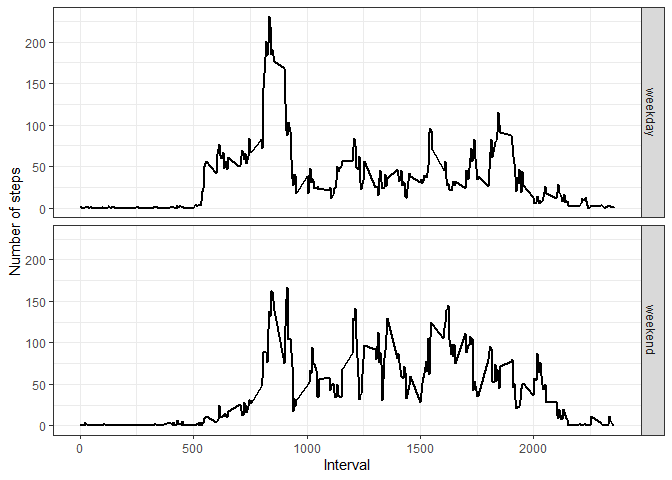

</br></br>

## Loading and preprocessing the data
***
</br>
Libraries:


```r
library(dplyr)
library(ggplot2)
```

</br>
Code to load data, with `readr::col_types` to parse columns' values in the correct format.


```r
raw_data <- 
    readr::read_delim(
        file = "activity.zip",
        delim = ",",
        na = "NA",
        col_names = TRUE,
        col_types = readr::cols(
            steps    = readr::col_double(),
            date     = readr::col_date(format = ""),
            interval = readr::col_double()
        )
    )
```

</br>

## What is mean total number of steps taken per day?
***
</br>

#### 1. Make a histogram of the total number of steps taken each day

Used `dplyr::filter()` to filter out NAs, `dplyr::group_by()` and `dplyr::summarise()` to respectively group by date (day) and calculate the sum of steps for each group. Then `ggplot2::geom_histogram()` to plot results.


```r
# prepare and compute data

daily_tot_steps <- 
    raw_data %>%
    filter(!is.na(steps)) %>%
    group_by(date) %>%
    summarise(tot_steps = sum(steps))


# plot the results

ggplot(daily_tot_steps) + 
geom_histogram(mapping = aes(x = tot_steps), binwidth = 750, fill = "gray66", color = "white") +
theme_bw() +
labs(x = "", y = "Count", title = "Histogram of the total number of steps taken each day")
```


</br>

#### 2. Calculate and report the **mean** and **median** total number of steps taken per day

</br>


```r
# penalize scientific notations

options(scipen = 9999)

# calculate mean and median

daily_steps_mean <- with(daily_tot_steps, round(mean(tot_steps, na.rm = TRUE), digits = 2))
daily_steps_med  <- median(daily_tot_steps$tot_steps, na.rm = TRUE)
```


```r
# mean
daily_steps_mean
```

```
## [1] 10766.19
```


```r
# median
daily_steps_med
```

```
## [1] 10765
```
</br>

The mean is **10766.19** and the median is **10765**.

</br>

## What is the average daily activity pattern?
***
</br>

#### 1. Make a time series plot of the 5-minute interval and the average number of steps taken, averaged across all days

Used `dplyr::filter()` to remove NAs, `dplyr::group_by()` and `dplyr::summarise()` to respectively group by interval and calculate the average of steps for each group. Then `ggplot2::geom_line()` to plot results.


```r
int_avg_steps <-
    raw_data %>%
    filter(!is.na(steps)) %>%
    group_by(interval) %>%
    summarise(avg_steps = mean(steps))


ggplot(int_avg_steps) +
theme_bw() +
geom_line(mapping = aes(x = interval, y = avg_steps), size = 0.8) +
labs(x = "Interval", y = "Average number of steps")
```


</br>

#### 2. Which 5-minute interval, on average across all the days in the dataset, contains the maximum number of steps?

</br>


```r
max_int <- as.numeric(int_avg_steps[which.max(int_avg_steps$avg_steps), 1])

# maximum 5-min interval
max_int
```

```
## [1] 835
```

</br>

## Imputing missing values
***
</br>

#### 1. Calculate and report the total number of missing values in the dataset

</br>


```r
miss_data <- sum(is.na(raw_data$steps))

# number of missing values
miss_data
```

```
## [1] 2304
```

</br>

#### 2. Devise a strategy for filling in all of the missing values in the dataset.

I replaced all missing values (NAs) with the correspondent 5-minute interval average, already calculated in the previous question.

</br>

#### 3. Create a new dataset that is equal to the original dataset but with the missing data filled in.

</br>


```r
fill_data <- raw_data

fill_data[is.na(fill_data$steps), 1] <- 
    int_avg_steps[int_avg_steps$interval %in% fill_data$interval, 2]
```

</br>

#### 4. Make a histogram of the total number of steps taken each day

</br>


```r
# prepare and compute data

fill_daily_steps <- 
  fill_data %>%
  group_by(date) %>%
  summarise(tot_steps = sum(steps, na.rm = TRUE))


# plot results

ggplot(fill_daily_steps) + 
  geom_histogram(mapping = aes(x = tot_steps), binwidth = 750, fill = "gray66", color = "white") +
  theme_bw() +
  labs(x = "", y = "Count", title = "Histogram of the total number of steps taken each day (filled)")
```


</br>

####  Calculate and report the mean and median total number of steps taken per day.

</br>


```r
# calculate meand and median

fill_steps_mean <- with(fill_daily_steps, round(mean(tot_steps, na.rm = TRUE), digits = 2))
fill_steps_med  <- median(fill_daily_steps$tot_steps, na.rm = TRUE)
```

```r
fill_steps_mean
```

```
## [1] 10766.19
```

```r
fill_steps_med
```

```
## [1] 10766.19
```

</br>

#### Do these values differ from the estimates from the first part of the assignment?

</br>

The differences are minimal; the mean and median of the dataset without NAs are respectively **10766.19** and **10765** while the same values for the "filled" dataset are **10766.19** and **10766.1886792**.  

</br>
The missing values are evenly distributed through the different intervals (full days misses) and replacing them with the interval average doesn't change mean and median values.


```r
# number of missing values for each interval

raw_data %>%
filter(is.na(steps)) %>%
group_by(interval) %>%
summarise(nr_of_missing = n()) %>%
glimpse()
```

```
## Observations: 288
## Variables: 2
## $ interval      <dbl> 0, 5, 10, 15, 20, 25, 30, 35, 40, 45, 50, 55, 100, 10...
## $ nr_of_missing <int> 8, 8, 8, 8, 8, 8, 8, 8, 8, 8, 8, 8, 8, 8, 8, 8, 8, 8,...
```

</br>


```r
# line plot of number of missing value for each interval

raw_data %>%
filter(is.na(steps)) %>%
group_by(interval) %>%
summarise(nr_of_missing = n()) %>%
ggplot() + 
geom_line(mapping = aes(x = interval, y = nr_of_missing), size = 0.8) +
theme_bw() +
labs(x = "Interval", y = "Number of missing values")
```

<!-- -->


## Are there differences in activity patterns between weekdays and weekends?
***
</br>


```r
weekday <-
    c("Monday", "Tuesday", "Wednesday", "Thursday", "Friday")

weekend <-
    c("Saturday", "Sunday")

fill_data %>%
mutate(
    day_type = case_when(
        weekdays(date) %in% weekday ~ "weekday",
        weekdays(date) %in% weekend ~ "weekend"
    ), day_type = forcats::as_factor(day_type)
) %>%
group_by(day_type, interval) %>%
summarise(avg_steps = mean(steps)) %>%
ggplot() +
geom_line(mapping = aes(x = interval, y = avg_steps), size = 0.8) +
theme_bw() +
facet_grid(rows = vars(day_type)) +
labs(x = "Interval", y = "Number of steps")
```



